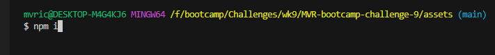
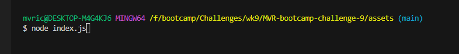
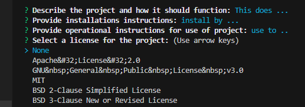
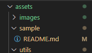

# MVR-bootcamp-challenge-9

## Node.js Challenge: Professional README Generator
This repository is used to generate a README.md file through the node terminal module by prompting the user for some information that is returned as a markdown file.

## Usage
Upon downloading the repository the user opens it up in their node terminal program and installs the required modules through "npm i" command.  
 
After installing the necessary modules, the user can then open the terminal in the "assets" directory and run the generator by using teh  "node index.js" command. 
 
The user is then prompted with a series of questions that will request information used to build the framework of the new "README.md" 
 
The newly generated "README.md" file can then be found in the "sample" directory for further refinements. 
 

## Contributors
Consulting and guidance used in creation of this repository include peers and resources (in no order) as follows:
* Lindsey Isaac
* Matt Montiel
* Brian Hamlin
* Daniel Cohen

## License
[MIT License](./LICENSE)
